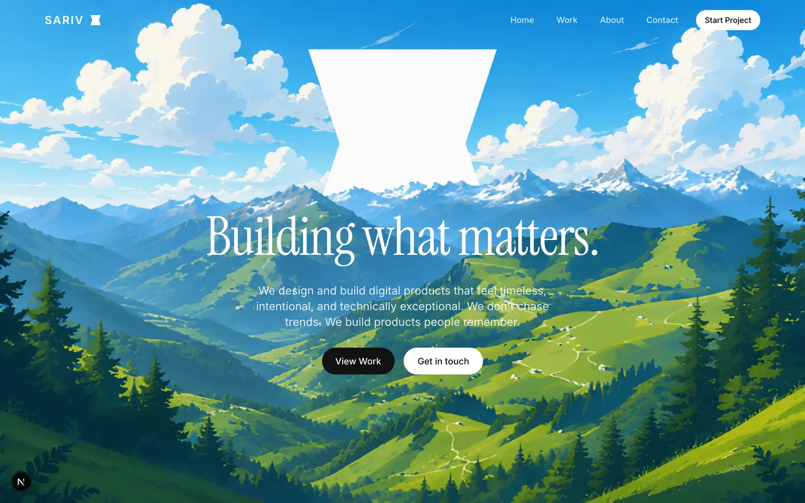
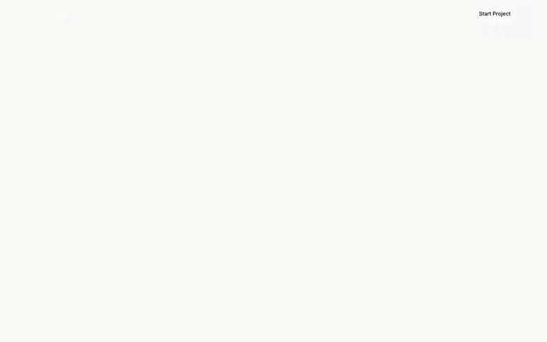
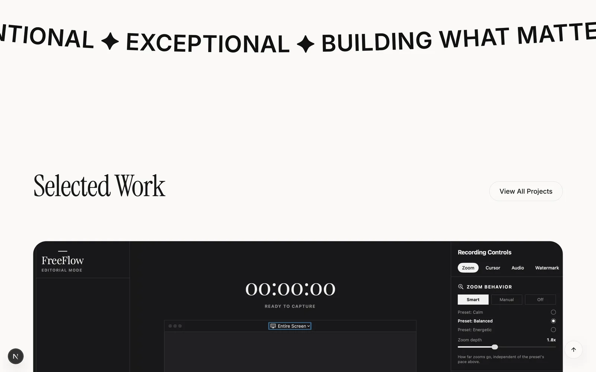
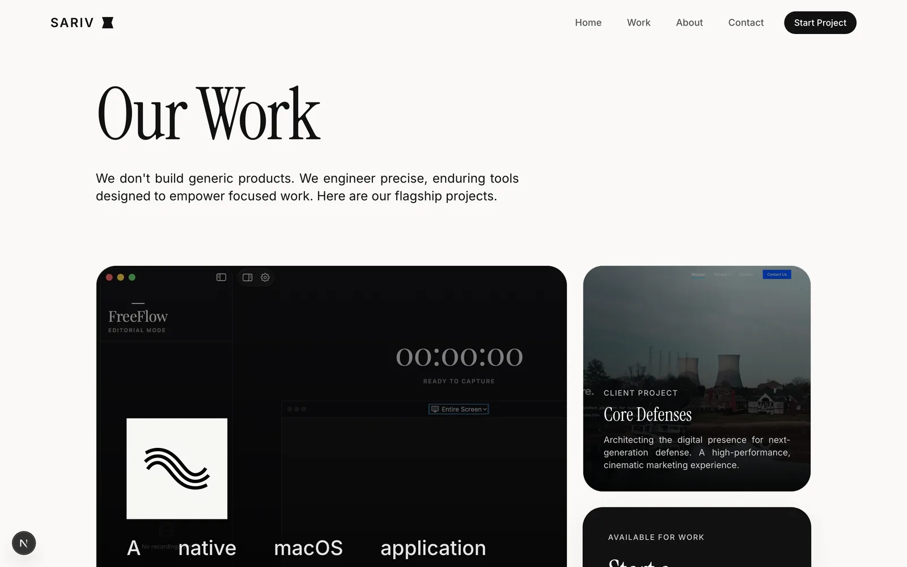
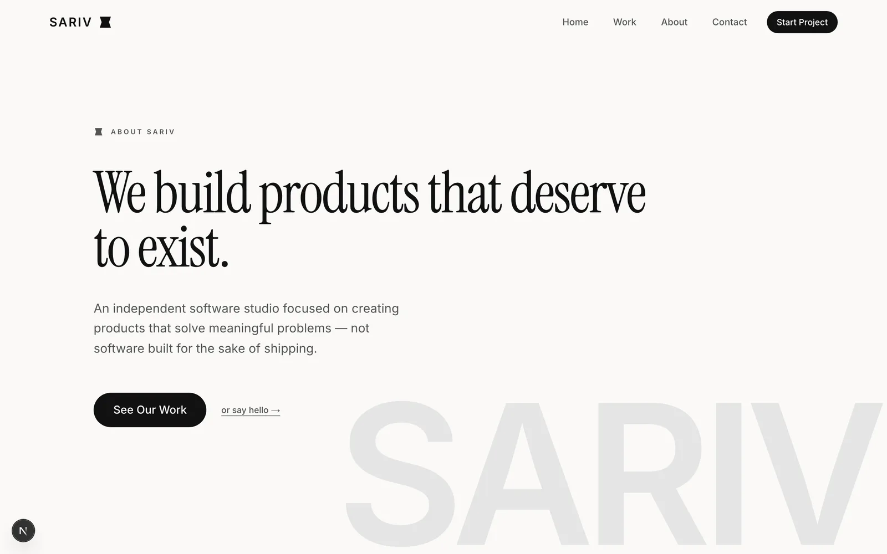
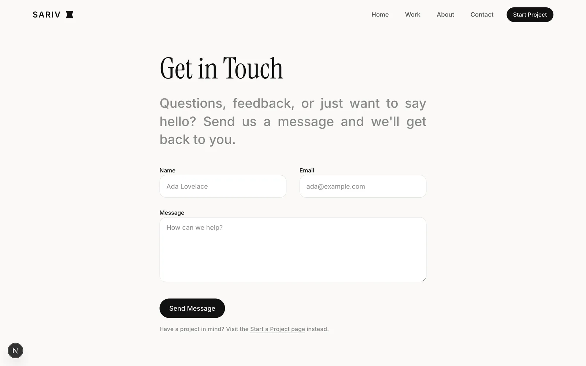
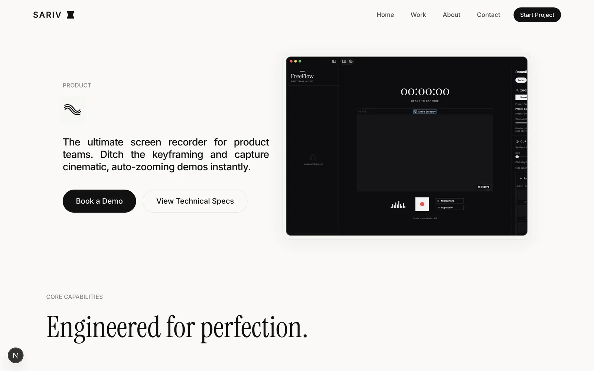

<div align="center">

# SARIV

**Building what matters.**

An independent software studio's marketing site — built as a product, not a brochure.

[](https://nextjs.org)
[](https://react.dev)
[](https://www.typescriptlang.org)
[](https://tailwindcss.com)
[](https://gsap.com)

</div>

<br />



<br />

## Overview

SARIV is a product-engineering studio, and this repository is its website — a Next.js App Router site built to demonstrate the same craft the studio sells. It leans on cinematic, GSAP-driven motion, a strict editorial type system (Instrument Serif + Inter), and a component library built on Radix primitives, rather than a generic template.

The site covers the full studio narrative: a scroll-driven homepage, a case-study **Work** section, a **FreeFlow** product page, a **Journal** (MDX-powered writing), and **About**/**Contact** pages — all wired into shared SEO infrastructure (sitemap, robots, JSON-LD) and a contact/start-project pipeline backed by API routes.

## Highlights

- **Next.js App Router** — server components by default, route-level metadata, and file-based SEO (`sitemap.ts`, `robots.ts`, JSON-LD)
- **Cinematic motion system** — GSAP `ScrollTrigger` + `ScrollSmoother` for pinned sections and scroll-spy navigation, layered with Framer Motion for UI transitions
- **Editorial design system** — semantic Tailwind v4 tokens (`surface`, `primary`, `secondary`, `border`) instead of hardcoded colors, so every page shares one visual language
- **MDX-powered Journal** — long-form writing rendered via `next-mdx-remote` and `gray-matter`
- **Accessible by default** — Radix UI primitives under the hood (dialog, tabs, accordion, toast, select, and more)
- **Form pipeline** — `react-hook-form` + `zod` validation, honeypot spam protection, and Nodemailer-backed API routes for Contact / Start a Project

## Screenshots



<sub>The homepage's hero → Selected Work sequence, captured at 10fps.</sub>



**Selected Work** — case-study cards on the homepage, including the FreeFlow product and a client dark-theme showcase.



**Work** — a bento-style project grid.

<table>
<tr>
<td width="50%"><br /><sub>About</sub></td>
<td width="50%"><br /><sub>Contact</sub></td>
</tr>
</table>



**FreeFlow** — one of the studio's own products, detailed on its own page.

## Tech Stack

| Layer | Choice |
|---|---|
| Framework | [Next.js 16](https://nextjs.org) (App Router, Turbopack) |
| Language | [TypeScript](https://www.typescriptlang.org) |
| UI | [React 19](https://react.dev), [Radix UI](https://www.radix-ui.com) |
| Styling | [Tailwind CSS 4](https://tailwindcss.com) |
| Motion | [GSAP](https://gsap.com) (ScrollTrigger, ScrollSmoother, `@gsap/react`), [Framer Motion](https://www.framer.com/motion/) |
| Forms | [react-hook-form](https://react-hook-form.com) + [Zod](https://zod.dev), [Nodemailer](https://nodemailer.com) |
| Content | [next-mdx-remote](https://github.com/hashicorp/next-mdx-remote) + [gray-matter](https://github.com/jonschlinkert/gray-matter) for the Journal |
| Testing | [Playwright](https://playwright.dev) (E2E) |
| Analytics / Hosting | [Vercel Analytics](https://vercel.com/analytics), [Vercel](https://vercel.com) |

## Project Structure

```
src/
├── app/               # Routes (App Router): home, work, about, contact,
│                       products/freeflow, journal, start-project, api/
├── components/         # Header, Footer, HeroScene, SmoothScrolling, Mark
│   ├── blocks/         # Larger composed sections (e.g. pricing)
│   └── ui/             # Buttons, inputs, toasts — the shared design system
├── lib/                # Utilities
content/journal/         # MDX articles
docs/                    # Design & product documentation, README assets
```

## Getting Started

```bash
git clone https://github.com/DhruvalBhinsara1/SARIV-Website.git
cd SARIV-Website
npm install
npm run dev
```

Open [http://localhost:3000](http://localhost:3000).

```bash
npm run build     # production build
npm start         # serve the production build
npm run lint      # ESLint
npm run test:e2e  # Playwright end-to-end suite
```

Deploys are configured for [Vercel](https://vercel.com) — push to `main` and connect the repo, or run `vercel deploy`.

## Design Philosophy

The visual and motion language follows SARIV's own internal documentation — [`docs/SARIV_DesignSystem.md`](docs/SARIV_DesignSystem.md), [`SARIV_MotionSystem.md`](docs/SARIV_MotionSystem.md), and [`SARIV_ComponentLibrary.MD`](docs/SARIV_ComponentLibrary.MD) — favoring timeless typography and strict grids over short-lived trends, with motion that's physical and purposeful rather than decorative.

## Performance & Accessibility

- Route-level metadata, canonical URLs, and JSON-LD structured data on every indexable page
- Auto-generated `sitemap.xml` and `robots.txt`
- `next/font` for zero-layout-shift, self-hosted Google Fonts
- Radix primitives for keyboard navigation, focus management, and screen-reader support out of the box

## License

Proprietary — © SARIV. All rights reserved. This code is shared for reference; no license is granted for reuse or redistribution.
